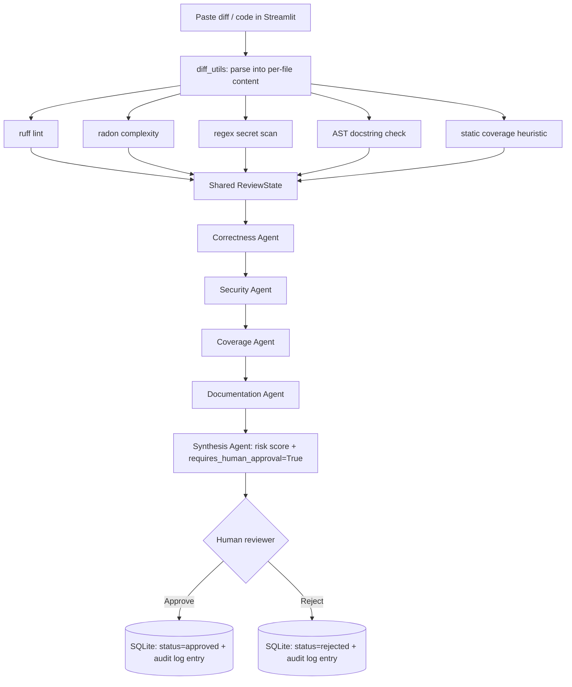

# ReviewSentinel AI

An AI-native, multi-agent code review accelerator. It runs deterministic static
analysis on a diff (or raw pasted code), hands the *evidence* — not the raw
code — to a small pipeline of reasoning agents, and produces a prioritized,
risk-scored report. A human always has to click Approve or Reject. Nothing in
this system can auto-merge anything, by design.

This exists as a companion piece to [CyberSentinel AI](https://github.com/RajolKumar2003/cybersentinel-ai)
(agentic network security investigation) — same engineering pattern (deterministic
tools + agent reasoning + human-in-the-loop), applied to the software development
lifecycle instead of network logs.

## Why this exists

Most "AI code review" demos let an LLM read a diff and generate findings out of
thin air. That's fast to build and impossible to defend in an interview, because
you can't answer "how do you know it's not hallucinating a vulnerability that
isn't there." This project takes the slower, more defensible approach:

- **Deterministic tools generate evidence.** Linting (ruff), cyclomatic
  complexity (radon), secret scanning (regex), docstring coverage (AST), and a
  static test-coverage heuristic all run as real, independently testable
  functions before any agent sees anything.
- **Agents only explain and prioritize that evidence.** They never see the raw
  diff and get asked to "find bugs" — they consume structured findings and
  narrate/rank them. Ask them to justify a finding and the answer is always
  "here's the analyzer output it came from."
- **`requires_human_approval` is hard-coded to `True`.** Not a default, not a
  config flag, not a confidence threshold. It's set unconditionally at the end
  of the synthesis agent and re-asserted again at the end of the pipeline
  function, so no future refactor can quietly remove it.
- **Submitted code is never executed.** Every analyzer is static (AST parsing,
  regex, or a linter subprocess). This is also *why* the "test coverage" signal
  here is a heuristic rather than a real `coverage.py` run — actually running
  untrusted code to measure coverage would turn a review tool into a code
  execution vector, which defeats the purpose of the tool.

## Architecture



Agent orchestration uses [LangGraph](https://github.com/langchain-ai/langgraph)
(`StateGraph` over the shared `ReviewState` TypedDict). If LangGraph fails to
import for any reason, `agents/pipeline.py` falls back to calling the same five
agent functions in the same order by hand — the app degrades gracefully instead
of crashing over one dependency.

## Features

| Feature | Status |
|---|---|
| Diff / raw code ingestion (paste, or two built-in samples) | Implemented |
| Ruff-based lint analysis | Implemented |
| Radon-based cyclomatic complexity analysis | Implemented |
| Regex-based secret/credential scanning | Implemented |
| AST-based docstring/documentation check | Implemented |
| Static test-coverage heuristic (name-reference based) | Implemented |
| 5-agent LangGraph pipeline with shared typed state | Implemented |
| Deterministic, non-LLM risk scoring | Implemented |
| Optional hosted LLM upgrade (Claude API) for evidence narration | Implemented, opt-in via env var |
| Hard-coded human approval gate | Implemented |
| SQLite-backed review + finding + audit log persistence | Implemented |
| Streamlit dashboard (submit / review / approve / audit trail) | Implemented |
| Real GitHub PR ingestion via GitHub API | Not implemented — see Limitations |
| FastAPI REST layer | Not implemented in this version — see Limitations |
| Docker / docker-compose | Not implemented in this version — see Limitations |

## Tech stack

| Layer | Choice | Why |
|---|---|---|
| UI / deployment target | Streamlit | Ships as a single deployable app, no separate frontend build |
| Agent orchestration | LangGraph | Explicit typed state machine instead of an ad-hoc chain of function calls |
| Static analysis | ruff, radon, `ast` (stdlib), regex | All static, none of them execute the code under review |
| Persistence | SQLite via SQLAlchemy | Zero setup, fine for a portfolio demo; swappable for Postgres later |
| Optional hosted reasoning | Anthropic API (Claude) | One env var (`ANTHROPIC_API_KEY`) upgrades agent explanations, everything still works without it |
| Testing | pytest | Unit tests per analyzer/agent, plus end-to-end pipeline tests on two fixture diffs |

## Project structure

```
review-sentinel-ai/
├── app.py                     # Streamlit dashboard, the deployable entry point
├── requirements.txt
├── .streamlit/config.toml     # theme
├── analyzers/
│   ├── diff_utils.py          # parses pasted diff / raw code into per-file content
│   ├── lint_analyzer.py       # ruff subprocess wrapper
│   ├── complexity_analyzer.py # radon cyclomatic complexity
│   ├── secret_scanner.py      # regex-based credential scanning
│   ├── documentation_analyzer.py  # AST docstring coverage check
│   └── coverage_analyzer.py   # static test-reference heuristic (no code execution)
├── agents/
│   ├── state.py                # shared ReviewState TypedDict
│   ├── llm_client.py            # optional Claude API wrapper, evidence-only prompting
│   ├── correctness_agent.py
│   ├── security_agent.py
│   ├── coverage_agent.py
│   ├── documentation_agent.py
│   ├── synthesis_agent.py       # risk scoring + hard-coded approval gate
│   └── pipeline.py              # LangGraph wiring + manual fallback
├── db/
│   ├── models.py                # Review, Finding, AuditLogEntry
│   └── database.py
├── sample_data/
│   ├── sample_clean.diff
│   └── sample_with_issues.diff
└── tests/
    ├── test_analyzers.py
    ├── test_agents.py
    └── test_pipeline.py
```

## Getting started (local)

Requires Python 3.10+.

```bash
git clone https://github.com/<your-username>/review-sentinel-ai.git
cd review-sentinel-ai
python -m venv .venv
source .venv/bin/activate        # Windows: .venv\Scripts\activate
pip install -r requirements.txt
streamlit run app.py
```

Open the URL Streamlit prints (usually `http://localhost:8501`). Use the "Load
sample diff with issues" button on the New Review tab to see a full run without
typing anything.

Running fully offline (no API key) is the default and intended mode — the
rule-based agents work with zero setup. To turn on the hosted LLM upgrade for
nicer evidence summaries:

```bash
export ANTHROPIC_API_KEY=your-key-here   # Windows: set ANTHROPIC_API_KEY=your-key-here
```

### Running the tests

```bash
pip install -r requirements.txt
pytest -v
```

## Deploying (Streamlit Community Cloud)

1. Push this folder to a GitHub repo (see the VS Code steps below).
2. Go to [share.streamlit.io](https://share.streamlit.io), sign in with GitHub.
3. Click "New app", pick the repo, branch `main`, main file path `app.py`.
4. (Optional) Under "Advanced settings" → "Secrets", add:
   ```toml
   ANTHROPIC_API_KEY = "your-key-here"
   ```
   Leave this out entirely to run in the free, fully offline mode.
5. Deploy. No Dockerfile or extra config needed — Streamlit Cloud reads
   `requirements.txt` and `.streamlit/config.toml` automatically.

**Note on persistence:** Streamlit Community Cloud's filesystem is ephemeral —
the SQLite database (and its review/audit history) resets whenever the app
redeploys or sleeps from inactivity. That's fine for demoing the workflow, but
it's a real limitation to be upfront about (see below) rather than a bug.

## Pushing this to GitHub from VS Code

1. Open this folder in VS Code (`File > Open Folder...`).
2. Open the built-in terminal (`` Ctrl+` ``) and run:
   ```bash
   git init
   git add .
   git commit -m "Initial commit: ReviewSentinel AI"
   git branch -M main
   git remote add origin https://github.com/<your-username>/review-sentinel-ai.git
   git push -u origin main
   ```
3. If you don't have the GitHub repo yet, create an empty one first (no
   README/gitignore, to avoid a merge conflict) at github.com/new, then run
   the commands above.
4. VS Code's Source Control tab (left sidebar) works too if you'd rather not
   type git commands — Initialize Repository, stage all, commit, then
   "Publish Branch".

## Limitations (genuinely, not hedging)

- **No real GitHub PR ingestion yet.** The app takes pasted diffs/code, not a
  live PR via the GitHub API. Adding that is a bounded task (fetch the diff,
  feed it into the same `run_pipeline` function) but isn't built here.
- **No FastAPI layer or Docker in this version.** The original design called
  for both; for a Streamlit-deployable portfolio piece they weren't necessary,
  so they were dropped rather than half-built. The agent/analyzer code has no
  Streamlit-specific dependencies, so a FastAPI layer could be added later by
  importing `agents.pipeline.run_pipeline` directly.
- **Diff reconstruction is best-effort for modified files.** A brand-new file
  in a diff gets reconstructed exactly. A diff against an *existing* file only
  gives us the added lines, so the linter/complexity tools see fragments, not
  the full file — this is called out explicitly in the UI, not hidden.
- **Test coverage is a static heuristic, not measured coverage.py output** —
  by design, since running untrusted submitted code for real coverage would be
  a code-execution risk in a tool whose entire job is reviewing untrusted code.
- **SQLite storage is ephemeral on Streamlit Cloud.** Fine for a demo, not
  something to point at for a real audit trail without swapping in a real
  database.

## Resume bullet suggestions

- Built ReviewSentinel AI, a multi-agent code review accelerator combining
  deterministic static analysis (ruff, radon, AST, regex) with a LangGraph
  agent pipeline that explains and prioritizes evidence rather than
  generating findings from raw code, enforcing a hard-coded human approval
  gate on every recommendation.
- Designed the system so submitted/untrusted code is never executed, using
  only static analysis techniques (AST parsing, subprocess linting, regex),
  including a static heuristic for test-coverage signal that avoids the
  code-execution risk of running arbitrary uploaded code.
- Implemented a graceful degradation path where the LangGraph orchestration
  layer falls back to a manual sequential agent chain if the dependency
  fails to load, keeping the app functional end to end regardless.

See `INTERVIEW.md` for a 2-minute pitch and likely interview questions.
